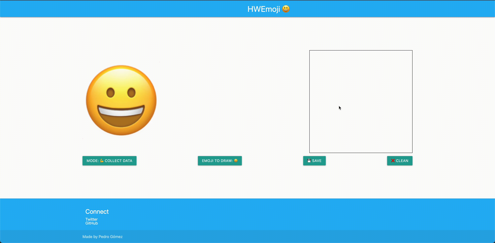
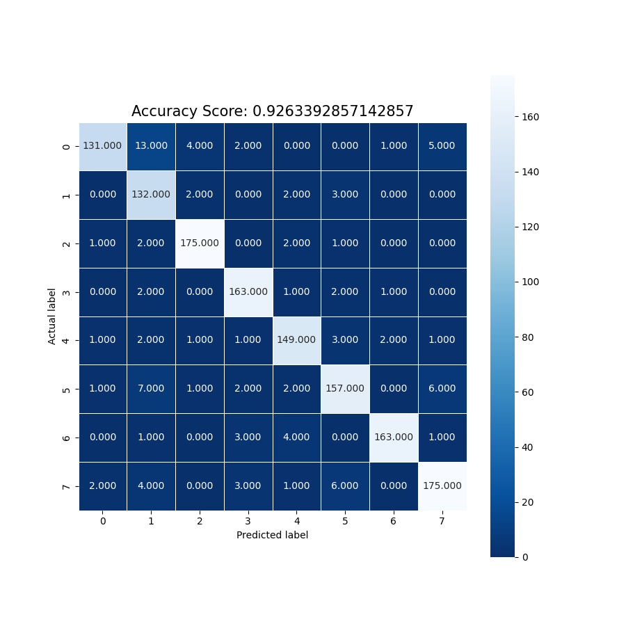

# HWEmoji

AI andwriting recognition for emojis 😃

This repository contains an artificial intelligence tool used to transform handwritten emojis into a real ones. Still under development, because the dataset is very small right now, but if you want to contribute, feel free to send a PR with including some data samples generated by yourself 😃 You can generate them from our demo site!

*Please, keep in mind we only support 8 emojis for now 1️⃣, ✅, ❗, ❤️, 🐶, 👀, 🔗, 😀 and out dataset is small and limited. We will try to improve step by step, remember this project has been developed by 1-man army 💪*

Inside the root folder you'll find 3 important directories:

* **dataset:** Where I save the data for now, I have less than 200 samples, so I can keep them in this repository for now.
* **model:** Where the artificial intelligence happens! A python project exporting a model in [ONNX](https://onnxruntime.ai/) format you can use from any other project.
* **web:** Sample project used to generate the data set and also to test the model.

The demo project executed the model in [ONNX](https://onnxruntime.ai/) format, this means you can use evaluate this model from the website using the sample code provided or get the model and execute it from any other programming language!

## How to use HWEmoji

1. [Install Python 3.7](https://www.python.org/downloads/release/python-377/).
2. If you are a OSX user remeber to execute the script ``Install Certificates`` you'll find inside the ``Applications/Python3`` installation folder
3. [Install pip](https://pip.pypa.io/en/stable/installing/)
4. Install all the dependencies: ``cd model && pip3 install -r requirements.txt``
5. Train and export the model: ``cd model && python3 HWEmoji.py``.

This will generate a ``hwemoji.onnx`` file inside the folder ``model/output/`` and will also update the web sample project with the new model generated. Feel free to copy this file and use it from your project, as soon as you respect the license terms and conditions everything will be ok 😃

## Model performance

In order to understand our model accuracy we generate some metrics reports inside ``/model/metrics``. This helps us to understand how our training process is going. Inside this folder you'll find:
 
 * Confussion matrix for the training result.
 * Accuracy per label.
 * Some prediction records.

This is the current accuracy value for the state of the project. As you can see, there is always room for improvement 😂

### Do you want to contribute?

Feel free to contribute, we will be glad to improve this project with your help. You can help me adding more samples to the data set or improving how we evaluate or train the model! Keep in mind that your PRs must be validated by GitHub Actions before being reviewed by any core contributor.

### Acknowledgement

Special thanks to [Akmaral Nurseit](https://twitter.com/akmaral_nurseit). This project idea came to my mind after an awesome talk he gave about how gen-z communication is changing the way people interact.

Developed By
------------

* Pedro Vicente Gómez Sánchez - <pedrovicente.gomez@gmail.com>

<a href="https://twitter.com/pedro_g_s">
  Pedro's Twitter Account
</a>
 
<a href="https://es.linkedin.com/in/pedrovgs">
  Pedro's LinkedIn Account
</a>
